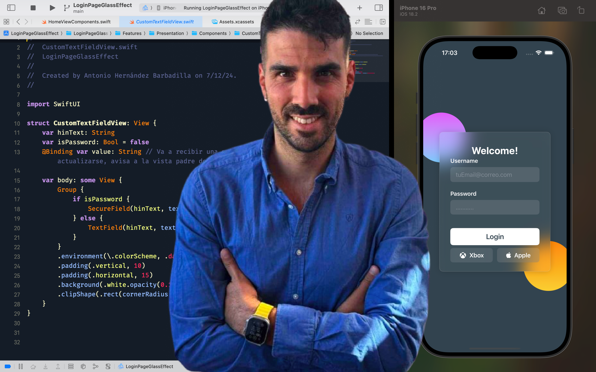

# 👋 ¡Hola! Soy Antonio Hernández  

## 🚀 Sobre mí  
💻 **Grado Superior en Desarrollo de Aplicaciones Web (DAW).**  
📱 Actualmente cursando el **Swift Developer Program con Apple Coding Academy**.  
🌱 Apasionado por el desarrollo en **Android (Java, Kotlin)** y **Swift (iOS)**.  
📚 Siempre aprendiendo sobre **frontend y backend**.  

## 🛠️ Tecnologías y herramientas  
🔹 **Lenguajes**: Swift, Objective-C, Java, JavaScript, PHP  
🔹 **Bases de datos**: SQLite, Firebase, MySQL  
🔹 **Frameworks**: SwiftUI, UIKit 
🔹 **Otros**: GitHub, Git, Markdown, Fork, GitKraken  

## 📌 Proyectos destacados  
- 📱 **[Mi App de Notas](https://github.com/tu-usuario/mi-app-notas)** (Android + SQLite)  
- ⏳ **[Temporizador Pomodoro](https://github.com/tu-usuario/pomodoro-app)** (Swift + SwiftUI)  
- 🌐 **[Mi portafolio](https://github.com/tu-usuario/mi-portafolio)** (HTML, CSS, JavaScript)  

## 📫 Contacto  
📧 Email: [antonio93hb@hotmail.com](mailto:antonio93hb@hotmail.com)  

💼 LinkedIn: [linkedin.com/in/antonio-hernández-barbadilla](https://www.linkedin.com/in/antonio-hernández-barbadilla-b49b81233/)  

---

🎯 **¡Siempre aprendiendo y mejorando!** 🚀✨
-->
